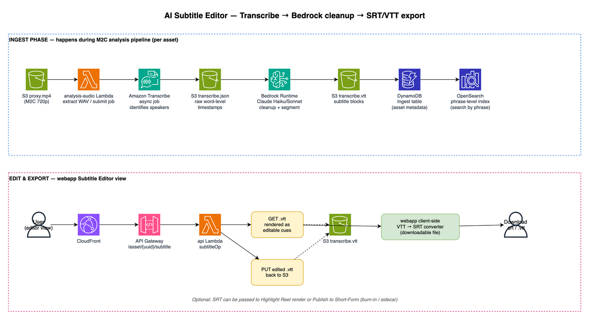
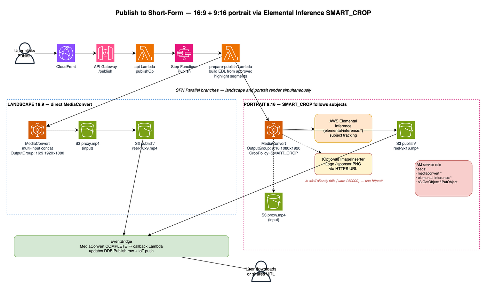
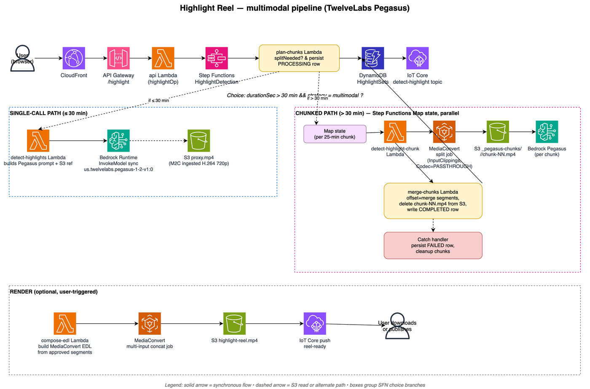
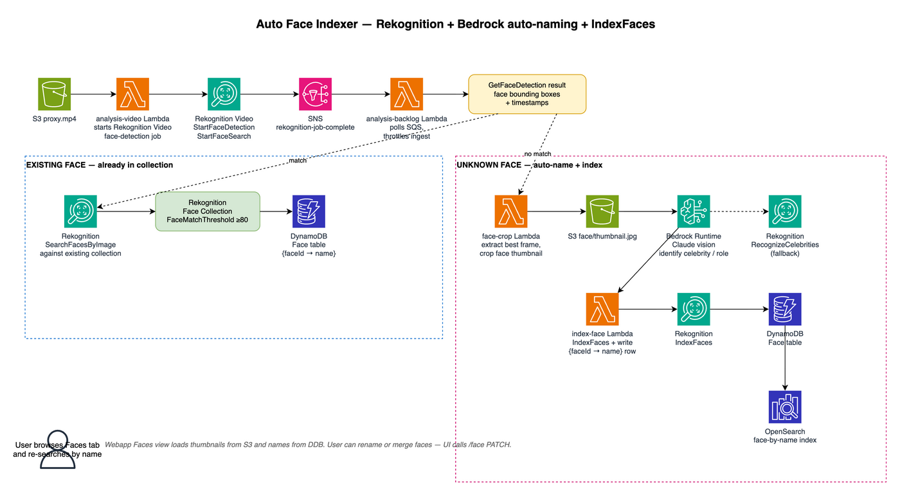
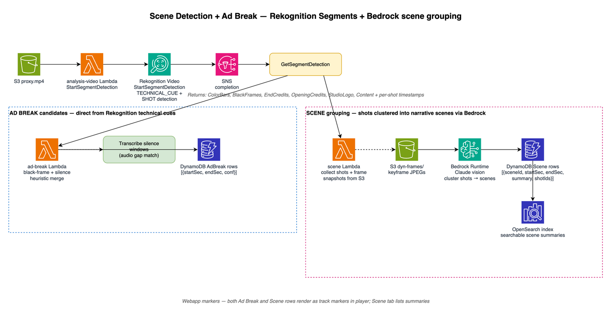
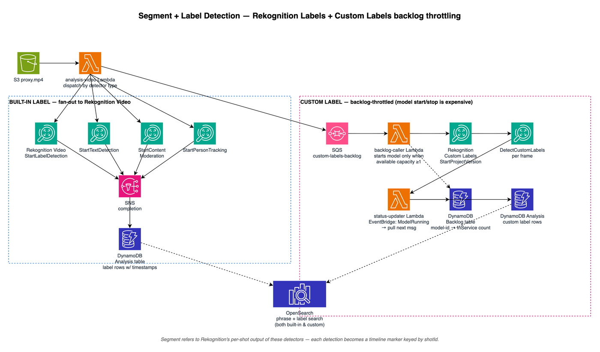
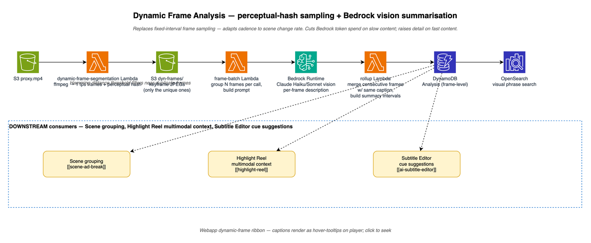

# Guidance for Media2Cloud on AWS

## Table of Contents

- [Features and Customizations](#features-and-customizations)
- [Upstream V4 features — architecture deep dive](#upstream-v4-features--architecture-deep-dive)
- [Stack parameters](#stack-parameters)
- [Building Media2Cloud V4 on your environment](#building-media2cloud-v4-on-your-environment)
- [Updating an Existing Stack](#updating-an-existing-stack)
- [Cost Estimation](#cost-estimation)
- [Deep dive into Media2Cloud V4](#deep-dive-into-media2cloud-v4)
- [V4 Demo Video Gallery](#v4-demo-video-gallery)
- [LICENSE](#license)
- [Collection of Operational Metrics](#collection-of-operational-metrics)

__

## Features and Customizations

This build adds five extensions on top of the upstream V4 baseline plus Cantonese (zh-HK) localization and build-system tweaks. Each extension is independently shippable and gated behind the same Cognito login as the rest of the app.

> **Per-feature architecture diagrams.** Each major feature below has a PNG render and a draw.io source under [`deployment/tutorials/diagrams/`](./deployment/tutorials/diagrams/). Open the `.drawio.xml` files with [app.diagrams.net](https://app.diagrams.net) or the VS Code [drawio extension](https://marketplace.visualstudio.com/items?itemName=hediet.vscode-drawio).

### Dynamic Bedrock model registry + editable prompts
Hard-coded Claude/Nova model IDs and system prompts are replaced with a runtime registry (`source/layers/core-lib/lib/genai/bedrockModel.js` + `source/api/lib/operations/modelsOp.js`).

**AWS services in play**
- [Amazon Bedrock](https://docs.aws.amazon.com/bedrock/latest/userguide/) — model registry queries `bedrock:ListFoundationModels` and the runtime calls `InvokeModel` with the registry-resolved model ID.
- [Amazon DynamoDB](https://docs.aws.amazon.com/amazondynamodb/latest/developerguide/) — per-feature system prompts persisted in the `Settings` table.

**What it does**
- New `GET /models` endpoint lists available Bedrock models per region.
- Per-feature system prompts (transcribe summary, scene description, ad-break taxonomy, highlight reasons, subtitle AI-edit) are editable from the Settings UI and persisted in DynamoDB.
- `maxTokens` is clamped per model so Nova Lite no longer fails at the output ceiling.

### Subtitle / Transcribe AI editing + SRT export
A side-by-side "AI editor" on the Transcribe tab that lets a producer rewrite, translate, or tighten captions with Bedrock and export the edited transcript as an SRT.


> Architecture diagram source: [`ai-subtitle-editor.drawio.xml`](./deployment/tutorials/diagrams/ai-subtitle-editor.drawio.xml)

**AWS services in play**
- [Amazon Transcribe](https://docs.aws.amazon.com/transcribe/latest/dg/) — async speech-to-text with speaker identification; output is word-level JSON with timestamps.
- [Amazon Bedrock Runtime](https://docs.aws.amazon.com/bedrock/latest/userguide/inference.html) — Claude Haiku/Sonnet `InvokeModel` for cleanup, translation, and re-segmentation.
- [Amazon S3](https://docs.aws.amazon.com/AmazonS3/latest/userguide/) — stores the raw `transcribe.json` and the cleaned `transcribe.vtt` next to the proxy; the editor PUTs the edited VTT back here on save.

**What it does**
- New tab UI: `source/webapp/src/lib/js/app/.../analysis/transcribe/transcribeTab.js`
- New API: `source/api/lib/operations/subtitleOp.js` (async background AI-edit job, polled by the webapp)
- New helper: `source/layers/core-lib/lib/srtHelper.js`
- Features: bilingual side-by-side editing, async LLM rewrite, SRT download (client-side VTT→SRT conversion).

**Notes**
- The VTT lives in S3 as the source of truth — the editor PUTs back to S3 on save, so the next webapp load reflects the edit. SRT export is a pure client-side conversion.
- The same VTT is used downstream by the Highlight Reel "transcript-llm" strategy and by Publish-to-VOD as an optional sidecar / burn-in caption track.

### Publish-to-Short-Form pipeline (landscape + portrait)
Lets the user pick a finished asset, choose 16:9 or 9:16, and submit a MediaConvert job that emits HLS + MP4 proxies into the Proxy bucket. The Publish tab shows job progress, finished outputs, signed download links, and a **Delete files** button that wipes the S3 prefix.


> Architecture diagram source: [`publish-short-form.drawio.xml`](./deployment/tutorials/diagrams/publish-short-form.drawio.xml)

**AWS services in play**
- [AWS Elemental MediaConvert](https://docs.aws.amazon.com/mediaconvert/latest/ug/) — multi-input concat job, separate `OutputGroup` per aspect ratio.
- [AWS Elemental Inference / SMART_CROP](https://docs.aws.amazon.com/mediaconvert/latest/ug/auto-crop.html) — invoked when the 9:16 portrait preset uses `CropPolicy=SMART_CROP`. Requires `elemental-inference:*` actions on the MediaConvert service role.
- [MediaConvert ImageInserter](https://docs.aws.amazon.com/mediaconvert/latest/ug/inserting-images.html) — optional logo / sponsor PNG overlay; **HTTPS-only** when used with SMART_CROP (an `s3://` URL silently fails with warning 250000).
- [Amazon EventBridge](https://docs.aws.amazon.com/eventbridge/latest/userguide/) — MediaConvert `COMPLETE` events route to a callback Lambda that updates the Publish row and pushes IoT Core notifications.

**What it does**
- API: `source/api/lib/operations/publishOp.js` + JSON job templates in `source/api/lib/operations/publish/tmpl/`
- UI: `source/webapp/src/lib/js/app/.../analysis/publish/publishTab.js`
- Two presets: `vod_landscape.json` (16:9) and `vod_portrait.json` (9:16, uses MediaConvert SMART_CROP).

**Notes**
- Landscape and portrait render in **parallel** Step Functions branches against the same input — render time ≈ longest single output, not sum.
- For SMART_CROP to work the IAM service role must include both `mediaconvert:*` **and** `elemental-inference:*`. Watch for error 1432 if the inference action is missing.

### Highlight clipping + video editor (short-form video)
Auto-detects highlight moments in a long-form video and lets the user assemble a short-form cut with a timeline editor. Uses **TwelveLabs Pegasus 1.2** on Bedrock for native-multimodal scoring, with chunking for inputs >30 minutes.


> Architecture diagram source: [`highlight-reel.drawio.xml`](./deployment/tutorials/diagrams/highlight-reel.drawio.xml)

**AWS services in play**
- [Amazon Bedrock Runtime — TwelveLabs Pegasus 1.2](https://docs.aws.amazon.com/bedrock/latest/userguide/model-providers-twelvelabs.html) — sync `InvokeModel` with `mediaSource.s3Location.bucketOwner` required; tops out around 60 min per call so we cap chunks at 25 min for timestamp accuracy.
- [AWS Elemental MediaConvert](https://docs.aws.amazon.com/mediaconvert/latest/ug/cutting-inputs.html) — for inputs >30 min, `InputClippings` + `Codec=PASSTHROUGH` stream-copy splits the proxy into 25-minute chunks without re-encoding.
- [AWS Step Functions Map state](https://docs.aws.amazon.com/step-functions/latest/dg/amazon-states-language-map-state.html) — runs Pegasus calls in parallel across chunks; `Catch` handler persists FAILED rows so jobs survive refresh.
- [Amazon DynamoDB](https://docs.aws.amazon.com/amazondynamodb/latest/developerguide/) — 4 new tables (`HighlightSets`, `EditProjects`, `Renders`, `HighlightSettings`).
- [AWS IoT Core](https://docs.aws.amazon.com/iot/latest/developerguide/) — pushes `started` / `progress` / `completed` events to the webapp via the existing M2C MQTT topic.

**Backend (`source/main/highlight/`)**
- `plan-chunks/` — chooses single-call vs chunked path (>30 min triggers chunking), persists the PROCESSING row, and emits Step Functions Map inputs.
- `detect-highlights/` — single-call multimodal Pegasus invocation when the video fits in 30 minutes.
- `detect-highlight-chunk/` — per-chunk Lambda: submits the MediaConvert split job, waits for chunk-NN.mp4, then calls Pegasus.
- `merge-chunks/` — offsets per-chunk timestamps back to the global timeline, deduplicates near-duplicate segments, deletes `_pegasus-chunks/<setId>/` from S3, and writes the COMPLETED (or FAILED) row.
- `compose-edl/` — converts the user-edited segment list into a MediaConvert clip-and-stitch job spec (HLS 1080p/720p/480p + MP4 proxy), 25 fps, CBR.
- `start-render/`, `render-status/`, `publish-to-library/` — render-stage Lambdas.

**API (`source/api/lib/operations/`)**
- `highlightOp.js` — `POST/GET/DELETE /highlight/{uuid}` and `/highlight/{uuid}/{highlightSetId}`. The `GET` list endpoint server-side merges saved edits from `EditProjects` so the UI shows the user's current segments, not the original auto-detected ones.
- `highlightSettingsOp.js` — editable per-asset detection config (model, prompt, max segments).
- `editsOp.js` — CRUD on `EditProjects` (segments, publish-to-library flag, aspect ratio, burn-captions flag).
- `rendersOp.js` — submit / list / get / delete renders. `DELETE` paginates the S3 prefix and removes every output object before deleting the DDB row.

**Frontend (`source/webapp/src/lib/js/app/.../analysis/highlight/`)**
- `highlightTab.js` — list/edit/delete highlight sets, render history.
- `highlightEditorModal.js` + `editorTracks.js` — drag-to-trim segment timeline with frame-accurate scrubbing.

**Notes**
- Chunking uses MediaConvert *stream-copy* (`Codec: PASSTHROUGH`), not re-encode. Audio is re-encoded to AAC 96 kbps because the underlying encoder rejects ADTS-in-MP4 stream copy. Chunks are scoped to `s3://<proxy>/<uuid>/_pegasus-chunks/` and IAM-restricted to that prefix only — highlight detection cannot reach raw or proxy media.
- Pegasus timestamp precision degrades on long inputs; the 25-minute chunk target is the sweet spot we found between extra Bedrock calls and tight timestamps.

### Cantonese (zh-HK) localization

**Chinese, Hong Kong (zh-HK)** added end-to-end:
- **Language code** registered in the dropdown (`source/webapp/src/lib/js/app/shared/languageCodes.js`, after `zh-TW`):
  ```javascript
  {
    name: 'Chinese, Hong Kong',
    value: 'zh-HK',
  },
  ```
- **Transcribe** forced to `zh-HK` for Cantonese audio.
- **Bedrock system prompts** for summarize / custom / image / scene-taxonomy / highlight-reasons rewritten to emit zh-HK output.

### Build-system tweaks

- **Pre-built Lambda layer packages** — `deployment/build-s3-dist.sh` now downloads the official AWS-built ExifTool (`image-process-lib-v4.0.9.zip`) and PDF (`pdf-lib-v4.0.9.zip`) layers from `s3://awsi-megs-guidances-us-east-1/media2cloud/v4.0.9/` instead of running the local Docker build for each. This drops ~10–15 min off every build, fixes the `canvas.node` native-module errors that occasionally hit document processing, and falls back to Docker only if the download fails. Modified functions: `build_image_process_layer`, `build_pdf_layer`.

__

## Upstream V4 features — architecture deep dive

The five extensions above sit on top of upstream Media2Cloud V4. Each upstream feature below has the same per-feature breakdown — what it does, AWS services in play with official doc links, an architecture diagram, and notes on non-obvious M2C-specific usage.

### Auto Face Indexer

Automatically indexes unrecognized faces during the analysis workflow. Uses Bedrock vision (with Rekognition `RecognizeCelebrities` as fallback) to suggest names, then `IndexFaces` adds the face to the collection. Late binding lets you tag the face after the run and the name propagates to every previously-analyzed clip without re-running analysis.


> Architecture diagram source: [`auto-face-indexer.drawio.xml`](./deployment/tutorials/diagrams/auto-face-indexer.drawio.xml)

**AWS services in play**
- [Amazon Rekognition Video — StartFaceDetection / StartFaceSearch](https://docs.aws.amazon.com/rekognition/latest/dg/faces-sqs-video.html) — async video face detection.
- [Amazon Rekognition — IndexFaces / SearchFacesByImage](https://docs.aws.amazon.com/rekognition/latest/dg/collections-index-faces.html) — collection-backed face matching with `FaceMatchThreshold ≥ 80`.
- [Amazon Rekognition — RecognizeCelebrities](https://docs.aws.amazon.com/rekognition/latest/dg/celebrities.html) — fallback when Bedrock can't identify the face.
- [Amazon Bedrock Runtime](https://docs.aws.amazon.com/bedrock/latest/userguide/) — Claude vision generates the suggested name from the cropped thumbnail.
- [Amazon SNS](https://docs.aws.amazon.com/sns/latest/dg/) + [SQS](https://docs.aws.amazon.com/AWSSimpleQueueService/latest/SQSDeveloperGuide/) — Rekognition completion notifications throttle ingest.
- [Amazon DynamoDB](https://docs.aws.amazon.com/amazondynamodb/latest/developerguide/) — `Face` table maps `faceId → name`.
- [Amazon OpenSearch Service](https://docs.aws.amazon.com/opensearch-service/latest/developerguide/) — face-by-name search across all assets.

**Notes**
- The "late binding" guarantee comes from indexing only after a face is *named* — renaming a face in the DDB row updates every reference everywhere because video metadata stores the `faceId`, not the name.

### Scene + Ad Break detection

Combines Rekognition's per-shot technical cues with Bedrock vision to cluster shots into narrative scenes. Ad-break suggestions come directly from Rekognition's `BlackFrames` / `EndCredits` / `OpeningCredits` cues, optionally aligned with Transcribe silence windows.


> Architecture diagram source: [`scene-ad-break.drawio.xml`](./deployment/tutorials/diagrams/scene-ad-break.drawio.xml)

**AWS services in play**
- [Amazon Rekognition Video — StartSegmentDetection](https://docs.aws.amazon.com/rekognition/latest/dg/segments.html) — `TECHNICAL_CUE` + `SHOT` modes return ColorBars, BlackFrames, EndCredits, OpeningCredits, StudioLogo, Content + per-shot timestamps.
- [Amazon Bedrock Runtime](https://docs.aws.amazon.com/bedrock/latest/userguide/) — Claude vision clusters keyframes into narrative scenes with descriptions, [IAB Content Taxonomy](https://www.iab.com/guidelines/content-taxonomy/), GARM Taxonomy, sentiment, brands and logos.
- [Amazon Transcribe](https://docs.aws.amazon.com/transcribe/latest/dg/) — silence windows refine ad-break candidates (audio gap match).
- [Amazon DynamoDB](https://docs.aws.amazon.com/amazondynamodb/latest/developerguide/) + [OpenSearch](https://docs.aws.amazon.com/opensearch-service/latest/developerguide/) — Scene rows + searchable summaries.

**Notes**
- Both Ad Break and Scene rows render as track markers in the player — same data path, different track.

### Segment + Label detection

Built-in label / text / moderation / person tracking via Rekognition Video, plus optional Custom Labels models gated by a backlog throttler so concurrent model starts don't blow the per-account inference quota.


> Architecture diagram source: [`segment-label.drawio.xml`](./deployment/tutorials/diagrams/segment-label.drawio.xml)

**AWS services in play**
- [Amazon Rekognition Video — Labels / Text / Content Moderation / Person Tracking](https://docs.aws.amazon.com/rekognition/latest/dg/video.html) — async detectors notify via SNS.
- [Amazon Rekognition Custom Labels](https://docs.aws.amazon.com/rekognition/latest/customlabels-dg/) — `StartProjectVersion` + `DetectCustomLabels`; throttled because model start/stop is expensive.
- [Amazon SQS](https://docs.aws.amazon.com/AWSSimpleQueueService/latest/SQSDeveloperGuide/) — `custom-labels-backlog` queue paces incoming requests.
- [Amazon EventBridge](https://docs.aws.amazon.com/eventbridge/latest/userguide/) — `ModelRunning` events drive the next backlog message.
- [Amazon DynamoDB](https://docs.aws.amazon.com/amazondynamodb/latest/developerguide/) — `Backlog` table tracks per-model `InService` count; `Analysis` table holds detection rows.

**Notes**
- "Segment" here = Rekognition's per-shot output of any of these detectors. Each detection becomes a timeline marker keyed by `shotId`, which is also what the Scene grouper consumes.

### Dynamic Frame Analysis

V3 sampled frames at a fixed FPS. V4 replaces that with **perceptual-hash sampling** — ffmpeg pulls candidate frames at 1 fps, a Hamming distance threshold drops near-duplicates, and only the unique frames go to Bedrock. Cuts Bedrock token spend on slow content; raises detail on fast content.


> Architecture diagram source: [`dynamic-frame-analysis.drawio.xml`](./deployment/tutorials/diagrams/dynamic-frame-analysis.drawio.xml)

**AWS services in play**
- [AWS Lambda](https://docs.aws.amazon.com/lambda/latest/dg/) — ffmpeg layer extracts 1 fps frames + a perceptual hash per frame.
- [Amazon S3](https://docs.aws.amazon.com/AmazonS3/latest/userguide/) — only the unique frames are persisted under `dyn-frames/`.
- [Amazon Bedrock Runtime](https://docs.aws.amazon.com/bedrock/latest/userguide/) — Claude Haiku/Sonnet vision generates per-frame descriptions in batches.
- [Amazon DynamoDB](https://docs.aws.amazon.com/amazondynamodb/latest/developerguide/) + [OpenSearch](https://docs.aws.amazon.com/opensearch-service/latest/developerguide/) — frame-level analysis rows + visual phrase search.

**Notes**
- The downstream consumers — Scene grouping, Highlight Reel multimodal context, Subtitle Editor cue suggestions — all reuse the same `dyn-frames/` JPEGs and per-frame captions instead of re-extracting frames.

__

## Stack parameters

> **No one-click template.** This build is **only** distributed by building from source — see [Building Media2Cloud V4 on your environment](#building-media2cloud-v4-on-your-environment). Build artefacts are not published to the upstream `awsi-megs-guidances-*` buckets, so the upstream "Launch stack" buttons would deploy the upstream V4 (no Pegasus highlight, no AI subtitle editor, no SMART_CROP publish, no zh-HK).

These are the parameters you set when launching (or updating) the CloudFormation stack with the template produced by `deploy-s3-dist.sh`. Stack creation takes about 30 minutes; on completion you receive an email invitation to the Media2Cloud web portal.

**Where parameters are set.** The parameter list itself is defined in the parent template `deployment/media2cloud.yaml` (the `Parameters:` block at the top of the file — that's where defaults and allowed values live). You supply values **at stack-create / stack-update time** in one of two places:

- **CloudFormation Console:** Stacks → Create / Update → on the *Specify stack details* page, every parameter from the table below shows up as a labelled input.
- **AWS CLI:** pass `--parameters ParameterKey=...,ParameterValue=...` to `aws cloudformation create-stack` / `update-stack`. See Step 5 in [Building Media2Cloud V4 on your environment](#building-media2cloud-v4-on-your-environment) for a working example, or use `UsePreviousValue=true` on `update-stack` to keep what's already set.

`BedrockSecondaryRegionAccess=YES` enables [Amazon Bedrock global cross-Region inference](https://docs.aws.amazon.com/bedrock/latest/userguide/global-cross-region-inference.html) for Anthropic Claude family models. `NO` disables Bedrock-backed Generative AI models.

| ParameterKey | ParameterValue | Description |
|:-- |:-- |:--|
|VersionCompatibilityStatement|Yes, I understand and proceed| (Mandatory) Make sure to read the version compatibility statement before you proceed|
| Email | YOUR@EMAIL.COM | (Mandatory) Fill in your email address. The email address is used to sign up to Amazon Cognito UserPool and to receive an invitation email to the Media2Cloud web portal |
|DefaultAIOptions | Recommended V4 features (v4.default) | Choose the default AI/ML settings. The settings can also be modified via the Media2Cloud web portal under the Settings page |
|PriceClass|Use Only U.S., Canada and Europe (PriceClass_100)|Choose the most appropriate Amazon CloudFront price class for your region |
|StartOnObjectCreation|NO|Enable auto-ingestion when a new object is uploaded to the Amazon S3 bucket (IngestBucket). Set to `YES` to start the analysis workflow on every upload; `NO` requires a manual start from the web portal.|
|UserDefinedIngestBucket|LEAVE IT BLANK|Optionally you can connect your existing ingest bucket to the Media2Cloud|
|OpenSearchCluster|Development and Testing (t3.medium=0,m5.large=1,gp2=10,az=1)|For testing and evaluation, a single instance is recommended. For staging and production, consider the Production configuration.|
|EnableKnowledgeGraph|NO|Select **YES** if you would like to enable Amazon Neptune graph database which allows you to visualize how your contents are connected in some ways.|
|CidrBlock|172.31.0.0/16|Applicable only if you enable Amazon Neptune graph|
|BedrockSecondaryRegionAccess|YES|`YES` allows Bedrock to use global cross-region inference. `NO` disables Generative AI models|
|BedrockModel|Anthropic Claude Haiku 4.5|Choose between `Anthropic Claude Haiku 4.5` or `Anthropic Claude Sonnet 4.6`. Both models are Text & Vision capable.|

__

## Building Media2Cloud V4 on your environment

> **Supported region.** This build is validated and deployed in **`us-west-2`** only. The Bedrock model IDs, Elemental Inference features (SMART_CROP, MediaConvert image-inserter HTTPS), and Cognito-hosted UI URLs all assume `us-west-2`. To deploy in another region, update the artefact bucket region below, set `--region` accordingly in every `aws` and `bash deploy-s3-dist.sh` invocation, and confirm the chosen Bedrock model IDs are GA in your target region. The CFN template now passes `AWS::Region` into Lambdas, so a region change is a one-line readiness check, not a code change.

#### _Prerequisites_
Make sure you have the following tools installed on your environment:
- [NodeJS 20.x](https://nodejs.org/en/download/current/)
- [AWS Command Line Interface (CLI)](https://aws.amazon.com/cli/)
- [jq](https://stedolan.github.io/jq/)
- [Docker](https://docs.docker.com/get-docker/)

#### _Step 1: Create an Amazon S3 bucket_

When you build the Media2Cloud V4 on your environment, you create artifacts such as the CloudFormation templates and the code packages in zip format. You need a S3 bucket to store the artefact such that you can launch the stack by pointing to your own version of CloudFormation templates.

Skip this step if you already have a S3 bucket that you plan to use.

```sh

aws s3api create-bucket --bucket yourname-artefact-bucket --region us-west-2 --create-bucket-configuration LocationConstraint=us-west-2

```

#### _Step 2: Clone GitHub repo_

Clone **this repo** — building from upstream `aws-solutions-library-samples/guidance-for-media2cloud-on-aws` will skip every customization documented in [Features and Customizations](#features-and-customizations) (the five extensions, zh-HK localization, pre-built layer downloads).

```sh

git clone https://github.com/hcwongleo/guidance-for-media2cloud-on-aws-hk

```

#### _Step 3: Run the build script_

```sh

# change to the deployment directory
cd guidance-for-media2cloud-on-aws-hk/deployment

bash build-s3-dist.sh \
  --bucket yourname-artefact-bucket \
  --version v4.1234 \
  --single-region > build.log 2>&1 &

# tail the build.log
tail -f build.log

```

\* _Tip 1: Always assign an unique version with `--version` flag to ensure Cloudformation Update stack operation works properly. If the version is not updated, the Update stack operation may skip updating some resources. Alternatively, you can update [.version](source/layers/core-lib/lib/.version) under source/layers/core-lib/lib/._

\* _Tip 2: Always include `--single-region` flag when you are building the stack for a single region use._

#### _Step 4: Deploy the build artefacts to your S3 bucket_

```sh

bash deploy-s3-dist.sh \
  --bucket yourname-artefact-bucket \
  --version v4.1234 \
  --single-region

```

The script prints the `media2cloud.template` HTTPS URL at the end (look for the line beginning `HTTPS URL:`); copy that URL for the next step.

#### _Step 5: Launch the CloudFormation stack_

Use the URL from Step 4 to create the stack. Parameter values are documented in [Stack parameters](#stack-parameters); minimal example:

```sh
aws cloudformation create-stack \
  --stack-name media2cloudv4 \
  --region us-west-2 \
  --template-url https://yourname-artefact-bucket.s3.us-west-2.amazonaws.com/media2cloud/v4.1234/media2cloud.template \
  --capabilities CAPABILITY_IAM CAPABILITY_NAMED_IAM CAPABILITY_AUTO_EXPAND \
  --parameters \
    "ParameterKey=VersionCompatibilityStatement,ParameterValue=Yes, I understand and proceed" \
    "ParameterKey=Email,ParameterValue=YOUR@EMAIL.COM" \
    "ParameterKey=BedrockSecondaryRegionAccess,ParameterValue=YES" \
    "ParameterKey=BedrockModel,ParameterValue=Anthropic Claude Haiku 4.5"
```

Stack creation takes ~30 minutes. On completion you receive a Cognito invitation email at the address you supplied.

__

## Updating an Existing Stack

To update your deployed Media2Cloud stack with new features or bug fixes:

> **Region.** This build runs in **`us-west-2`** only. Pass `--region us-west-2` to every `aws` command in this section. The artefact S3 bucket must be the **same bucket the stack was originally deployed from** — pulling templates from a different bucket will break the nested-stack URL chain. To find which version a Lambda in the stack is currently running (which equals the deploy bucket prefix), inspect any so0050-prefixed function's code location:
> ```sh
> FN=$(aws lambda list-functions --region us-west-2 \
>        --query 'Functions[?starts_with(FunctionName, `so0050-`)] | [0].FunctionName' \
>        --output text)
> aws lambda get-function --region us-west-2 --function-name "$FN" \
>   --query 'Code.Location' --output text
> # → https://<bucket>.s3.<region>.amazonaws.com/media2cloud/<version>/<package>.zip?...
> ```

### Step 1: Build New Version

```sh
cd deployment

# Always bump the version. Reusing an existing version can leave Lambda
# code stale even when CFN reports UPDATE_COMPLETE (CFN compares S3 keys,
# not zip contents — same key = no redeploy).
bash build-s3-dist.sh \
  --bucket YOUR-BUCKET-NAME \
  --version v4.0.11 \
  --single-region
```

### Step 2: Deploy to S3

```sh
bash deploy-s3-dist.sh \
  --bucket YOUR-BUCKET-NAME \
  --version v4.0.11 \
  --single-region
```

The deploy script auto-detects the bucket's region from `s3api get-bucket-location` and prints the resulting `media2cloud.template` HTTPS URL — copy that URL for Step 3.

### Step 3: Update CloudFormation Stack

**Option A - AWS Console (Recommended):**
1. Open the [CloudFormation Console](https://console.aws.amazon.com/cloudformation/home?region=us-west-2) **in `us-west-2`**.
2. Select your stack → Click **Update**.
3. Choose **Replace current template**.
4. Paste the new template URL from Step 2's deploy output.
5. Keep all existing parameters (do not change).
6. Submit and wait for `UPDATE_COMPLETE` (10–20 minutes).

**Option B - AWS CLI:**
```sh
aws cloudformation update-stack \
  --stack-name media2cloudv4 \
  --region us-west-2 \
  --template-url https://YOUR-BUCKET.s3.us-west-2.amazonaws.com/media2cloud/v4.0.11/media2cloud.template \
  --capabilities CAPABILITY_IAM CAPABILITY_NAMED_IAM CAPABILITY_AUTO_EXPAND \
  --parameters \
    ParameterKey=Email,UsePreviousValue=true \
    ParameterKey=DefaultAIOptions,UsePreviousValue=true \
    ParameterKey=PriceClass,UsePreviousValue=true \
    ParameterKey=StartOnObjectCreation,UsePreviousValue=true \
    ParameterKey=OpenSearchCluster,UsePreviousValue=true \
    ParameterKey=BedrockSecondaryRegionAccess,UsePreviousValue=true \
    ParameterKey=BedrockModel,UsePreviousValue=true
```

> Use the **regional** virtual-host URL `https://<bucket>.s3.us-west-2.amazonaws.com/...`, not the legacy regionless `s3.amazonaws.com` form — newer buckets in `us-west-2` reject the regionless host.

**Troubleshooting — `UPDATE_COMPLETE` but features still broken (same-version rebuild only).** If you skip the version bump and reuse e.g. `v4.0.11`, CFN compares S3 keys (not zip bytes) and treats every Lambda, layer, and webapp custom-resource as already up-to-date — so `UPDATE_COMPLETE` finishes but the live stack runs the previous code. Symptoms: new API operations return `M2CException: operation '...' not supported`; runtime throws `TypeError: Cannot read properties of undefined` because the **layer** still has the old `core-lib` (missing newly added exports); the webapp keeps loading the old `app.min.js`.

**The clean fix is to bump the version (e.g. `v4.0.11` → `v4.0.12`) and rerun Steps 1-3 — unique S3 keys make CFN diff cleanly and refresh everything in one shot.**

If you must iterate on the same version, you have to manually refresh all three layers:

```sh
# 1. Lambda code — for every so0050-prefixed function
aws lambda update-function-code \
  --function-name <function-name> \
  --s3-bucket YOUR-BUCKET-NAME \
  --s3-key media2cloud/v4.0.11/<package-name>.zip \
  --region us-west-2

# 2. Layers — publish a new version for each layer (core-lib, aws-sdk-lib,
#    tokenizer, fixity-lib, image-process-lib, jimp, mediainfo, pdf-lib,
#    service-backlog-lib), then re-attach every Lambda to the new layer ARN
#    via `update-function-configuration --layers ...:N+1`. Without re-attach,
#    the new layer exists but no Lambda uses it.

# 3. Webapp — sync the new bundle into the WebBucket and invalidate CloudFront
#    (preserve solution-manifest.js / appConfig.js — the CopyWebContent custom
#    resource writes those at stack-update time).
```

**Important:** Stack updates modify Lambda code and infrastructure, but **preserve all your data** (S3 files, DynamoDB tables, OpenSearch indices, user accounts).

__

## Cost Estimation

> **Disclaimer.** All numbers below are **rough order-of-magnitude estimates** based on public AWS list pricing in `us-west-2` as of 2026-05-21. Real costs vary by Region, contract discount (EDP / private pricing), traffic profile, OpenSearch sizing, and whether Bedrock cross-region inference is enabled. Prices change without notice — always confirm with the [AWS Pricing Calculator](https://calculator.aws) before quoting a customer. Costs are quoted in **USD**. Bedrock token volumes are estimates derived from average transcript length per minute of speech (~150 words/min ≈ 200 tokens/min in Chinese).

Three cost categories to keep separate in your head:

| Category | Trigger | Billing cadence |
|---|---|---|
| **A. Always-on infrastructure** | The CFN stack exists | Monthly, whether or not anyone uses it |
| **B. One-shot, per action** | User uploads a video, clicks Detect highlights, clicks Render, clicks Publish | Once, when the action runs |
| **C. Recurring storage** | An asset (master / proxy / render / publish output) is in S3 | Monthly per GB, until Deleted |

Section §5 stitches A + B + C together for a representative customer demo.

### 1. (Category A) Always-on infrastructure — per month

What you pay just for the stack to exist, **before any video is ingested**. Most cost concentrates in OpenSearch and (if enabled) Neptune.

| Component | Configuration | ~Monthly cost |
|---|---|---|
| Amazon OpenSearch (Dev/Test) | 1× `m5.large.search`, 10 GB gp2, 1 AZ | ~ **$110** |
| Amazon OpenSearch (Production) | 3× `m5.large.search`, 100 GB gp2, 2 AZ + 3 dedicated masters | ~ **$650** |
| Amazon DynamoDB | On-demand, 9 small tables (Ingest, Analysis, Faces, AdBreak, HighlightSets, EditProjects, Renders, HighlightSettings, etc.) — only billed on use | ~ **$1–5** at idle |
| Amazon CloudFront + S3 (web app) | 1 distribution + ~30 MB static assets | ~ **$1** |
| Amazon API Gateway | Idle | ~ **$0** (per-request) |
| AWS Lambda | Idle | ~ **$0** (per-invocation) |
| AWS IoT Core | 1 thing, low MQTT volume | ~ **$0–1** |
| Amazon Cognito User Pool | < 50 MAU | **$0** (free tier) |
| Amazon Neptune (only if `EnableKnowledgeGraph=YES`) | 1× `db.t3.medium` | ~ **$60** |
| **Subtotal — idle stack (no Neptune, Dev OpenSearch)** | | **~ $115/mo** |
| **Subtotal — idle stack (no Neptune, Prod OpenSearch)** | | **~ $655/mo** |

> Biggest single line item is OpenSearch. For demos/POCs use the Dev/Test cluster size; switch to Production sizing only when you start ingesting your real catalogue.

### 2. (Category B) One-shot per video — Ingest + Analysis

Variable cost for **one upload + analyze run**. Charged once when the user uploads. The pipeline scales linearly with **video duration**, not file size, because almost every downstream service is billed per-minute.

Assumptions: H.264 1080p source, single audio track, English/Chinese transcript, default V4 AI options (Rekognition Video labels + Celebrities + Faces + Segments, Transcribe, dynamic frame analysis with average ~1 frame every 3 sec, scene description on every detected scene).

| Service | What it does | Unit price (us-west-2) | 5 min | 30 min | 60 min |
|---|---|---|---|---|---|
| AWS Elemental MediaConvert (proxy + frames) | Builds the MP4 proxy, HLS, audio proxy, frame thumbs | ~$0.0075/min (Pro tier) | **$0.04** | **$0.23** | **$0.45** |
| Amazon Transcribe | Speech-to-text | $0.024/min | **$0.12** | **$0.72** | **$1.44** |
| Amazon Rekognition Video — Labels | DetectLabels on segments | $0.10/min | **$0.50** | **$3.00** | **$6.00** |
| Amazon Rekognition Video — Celebrities | RecognizeCelebrities | $0.10/min | **$0.50** | **$3.00** | **$6.00** |
| Amazon Rekognition Video — Faces | DetectFaces + IndexFaces | $0.10/min + $0.001/face indexed | **$0.50** | **$3.00** | **$6.00** |
| Amazon Rekognition Video — Segments | Shot/segment detection | $0.05/min | **$0.25** | **$1.50** | **$3.00** |
| Amazon Rekognition Image (dynamic frame analysis) | Per selected keyframe | $0.001/image | ~$0.10 (~100 frames) | ~$0.60 (~600 frames) | ~$1.20 (~1200 frames) |
| Amazon Bedrock — Claude Haiku 4.5 (scene description, IAB/GARM, sentiment) | Vision + Text per scene | $0.25/MTok in, $1.25/MTok out | ~$0.05 | ~$0.30–$0.60 | ~$0.60–$1.20 |
| Amazon Bedrock — embeddings (Titan v2) | One vector per keyframe | $0.00002/1K tok | < $0.01 | < $0.05 | < $0.10 |
| Amazon DynamoDB writes | On-demand WCUs | $1.25/M writes | < $0.01 | < $0.01 | < $0.01 |
| AWS Lambda + Step Functions | Orchestration | per-invocation | ~$0.05 | ~$0.20 | ~$0.40 |
| **Total per analyze run (one-shot)** | | | **~ $2.10** | **~ $12.50** | **~ $25.30** |

> The Bedrock vision line scales with the number of keyframes × ~1.5K image tokens each — the range above brackets denser vs. sparser scene cuts. Storage for the proxy / frames / JSON is **not** in this table; it lives in §4 because it's monthly.

**Sensitivities**
- **Disabling Celebrities or Faces** drops ~$0.10/min each — flip them off in `DefaultAIOptions` if not needed.
- **Switching Bedrock model from Haiku 4.5 → Sonnet 4.6** raises the Bedrock line ~5×.
- **Auto highlight detection** does **not** run during the analyze pipeline — it's a separate one-click action billed under §3a.

### 3. (Category B) One-shot per action — Highlight detection + Render + Publish

**Additional** costs on top of §2, only billed when the user actually clicks **Detect highlights**, **Render**, or **Publish**.

#### 3a. Highlight detection (one click → one or more Bedrock calls)

The detect-highlights pipeline picks one of two strategies based on speech density (≥0.6 words/sec → transcript-llm, < 0.6 → multimodal). The user can override. Multimodal videos longer than 30 min are auto-chunked into 25-minute Pegasus calls (see [Highlight clipping + video editor](#highlight-clipping--video-editor-short-form-video)).

**transcript-llm path** — sends the full transcript text only. Cost is dominated by transcript length.

Default model is **Amazon Nova Pro** (us-west-2 list: $0.80 / MTok input, $3.20 / MTok output).

| Source duration | ~Tokens in / out | Nova Pro (default) | Claude Haiku 4.5 | Claude Sonnet 4.6 |
|---|---|---|---|---|
| 5 min | ~1.5K in / 1K out | **~ $0.005** | ~ $0.002 | ~ $0.02 |
| 30 min | ~9K in / 2K out | **~ $0.014** | ~ $0.005 | ~ $0.05 |
| 60 min | ~18K in / 3K out | **~ $0.024** | ~ $0.008 | ~ $0.08 |
| 2 h | ~36K in / 4K out | **~ $0.042** | ~ $0.014 | ~ $0.13 |

**multimodal path** — sends the proxy MP4 directly to Bedrock as a native video input. The default model is **TwelveLabs Pegasus 1.2** (us-west-2 list: **$0.0015 / second of video** = $0.09 / min, plus a fixed text-output line item that's < $0.01 in practice). Pegasus is the cost-leader for multimodal video understanding because it bills by source seconds, not by image-token expansion of every frame.

| Source duration | Pegasus 1.2 (default) | Notes |
|---|---|---|
| 5 min | **~ $0.45** | Single Pegasus call |
| 30 min | **~ $2.70** | Single Pegasus call (right at the auto-chunk boundary) |
| 60 min | **~ $5.40** | Auto-chunked into 3× 25-min Pegasus calls + 1 MediaConvert split job (~$0.45) ≈ **~ $5.85** |
| 2 h | **~ $10.80** | Auto-chunked into ~5× 25-min Pegasus calls + 1 MediaConvert split job (~$0.90) ≈ **~ $11.70** |

> Multimodal is **roughly 200×** more expensive than transcript-llm. Prefer it only when the transcript is sparse or absent (silent demos, b-roll, action footage, sports). The auto-picker already does this for you.

> **MediaConvert split job overhead.** Chunking uses stream-copy (`Codec: PASSTHROUGH`) so the split is encoder-free for video, but audio is re-encoded to AAC 96 kbps. At ~$0.0075/min (Basic tier, single output) a 60-min video splits for ~$0.45 — small relative to Pegasus.

Lambda + DDB cost is < $0.01 per detection on either path. Switch models from the highlight Settings UI (the Bedrock model registry described in [Features and Customizations](#features-and-customizations)).

#### 3b. Render (compose-edl → MediaConvert clip-and-stitch)

The user picks N segments totaling D minutes; MediaConvert renders HLS (1080p/720p/480p) + an MP4 proxy.

| Output duration (sum of segments) | MediaConvert (Pro tier, 4 outputs ≈ 4× minutes) | **One-shot cost** |
|---|---|---|
| 1 min | ~$0.030 | **~ $0.03** |
| 3 min | ~$0.090 | **~ $0.09** |
| 5 min | ~$0.150 | **~ $0.15** |
| 10 min | ~$0.300 | **~ $0.30** |

> The Pro tier kicks in because of HD H.264 + 3 outputs ≥ 30 fps. Use the **Basic** tier (~$0.0075/min) by dropping the 1080p rung if cost matters more than quality. (Render output bytes are stored in S3 — see §4.)

#### 3c. Publish-to-VOD (16:9 or 9:16 portrait)

Same MediaConvert math as 3b, but billed against the **published** asset duration. For the 9:16 portrait preset, MediaConvert SMART_CROP additionally invokes **AWS Elemental Inference**, billed per output minute on top of the Pro tier line.

**Elemental Inference list pricing (us-west-2)** — bundled discount when features stack in the same job:
- 1 feature (e.g. SMART_CROP only) → **$0.15/min** ($9.00/hour)
- 2 features (e.g. SMART_CROP + ImageInserter) → **$0.23/min** ($13.80/hour)

| Aspect | Per-minute cost |
|---|---|
| 16:9 landscape | ~$0.030/min (Pro tier, 4 outputs) |
| 9:16 portrait (SMART_CROP, 1 inference feature) | ~$0.030/min Pro + **$0.15/min inference** ≈ **$0.18/min** |

A 60-second short published in portrait ≈ **$0.18** + storage (§4).

### 4. (Category C) Recurring storage — per month, per asset

Every asset persists in S3 until you delete it (the Publish tab's **Delete files** button removes Render + Publish output prefixes on demand). All four prefixes below are **S3 Standard at $0.023/GB-mo**.

| Bucket / prefix | What's in it | Typical size for one 60-min 1080p source |
|---|---|---|
| Ingest bucket | Original master upload | ~ 3 GB |
| Proxy bucket — `proxies/{uuid}/` | MediaConvert proxy + frames + JSON metadata | ~ 1.5 GB |
| Proxy bucket — `renders/{uuid}/{renderId}/` | One highlight render output | ~ 0.25 GB per render |
| Proxy bucket — `outputs/{uuid}/{outputId}/` | One publish output | ~ 0.05 GB per 60-sec portrait short |

| Asset profile | Total GB | **Storage cost / month** |
|---|---|---|
| 30-min source, no renders/publishes | ~ 2.3 GB | **~ $0.05/mo** |
| 60-min source, no renders/publishes | ~ 4.5 GB | **~ $0.10/mo** |
| 60-min source + 1 render + 1 publish | ~ 4.8 GB | **~ $0.11/mo** |

> Move analyzed-but-cold assets to S3 Glacier Instant Retrieval (~$0.004/GB-mo) for ~80% savings. The ingest master is usually the largest line — consider lifecycle to Glacier after the proxy is built.

### 5. End-to-end example (one customer demo)

Single 30-minute Cantonese source, on the **Dev/Test stack**, doing: full analyze + 1 highlight detection (transcript-llm) + 1 render of a 90-second short + 1 publish in 9:16 portrait.

**Month 1 — first time the customer uses the stack:**

| Category | Step | Cost |
|---|---|---|
| A | Always-on infra (1 month) | $115.00 |
| B | Analyze run (30 min source, default AI options) | $12.50 |
| B | Highlight detection (Nova Pro, transcript-llm) | $0.01 |
| B | Render 90 s short | $0.05 |
| B | Publish 90 s portrait (SMART_CROP, 1 inference feature) | $0.27 |
| C | Storage for master + proxy + render + publish (1 month) | $0.10 |
| | **Total** | **~ $128** |

**Month 2 onwards — same customer keeps that one asset around but does nothing new:**

| Category | Step | Cost |
|---|---|---|
| A | Always-on infra | $115.00 |
| C | Storage for the asset | $0.10 |
| | **Total** | **~ $115/mo** |

**Each *additional* 30-min video processed the same way (one-shot, Category B only):**

| Step | Cost |
|---|---|
| Analyze run | $12.50 |
| Highlight detection (Nova Pro, transcript-llm) | $0.01 |
| Render 90 s short | $0.05 |
| Publish 90 s portrait | $0.27 |
| **Marginal one-shot per video** | **~ $12.83** |

Each new asset then adds **~$0.10/mo** to the storage tail until it's deleted. Switching that highlight detection from transcript-llm to **multimodal Pegasus 1.2** would push the per-video one-shot to ~$15.50 instead of $12.83.

**Cost-saving levers**
1. Run on **Dev/Test OpenSearch** for POCs (–$540/mo vs Production sizing — biggest single lever).
2. Disable Rekognition Video Celebrities + Faces if you don't need them (–$0.20/min ≈ –$6/30-min video).
3. Use **Claude Haiku 4.5** for scene description on non-hero content (–~80% on the Bedrock vision line).
4. Let highlight detection auto-pick its strategy — only force multimodal when speech is sparse (it's 20–60× the cost).
5. Move analyzed-but-cold assets to **S3 Glacier Instant Retrieval** (–80% on storage tail).
6. Use the publish tab's **Delete files** button after a render is exported elsewhere — render outputs are easily 250 MB+ each.

__

## Deep dive into Media2Cloud V4

#### _Resource naming convention_

The resources created by the Media2Cloud CloudFormation stack follow a naming convention that follows the pattern [SolutionID]-[PartialStackID]-[WorkflowName]. The SolutionID for Media2Cloud is `so0050`, the PartialStackID is a unique ID generated by CloudFormation upon stack creation, and the WorkflowName can be `ingest`, `analysis`, or other workflow names. For example, the Ingestion Main state machine would be named `so0050-000000000000-ingest-main`, and a lambda function in the Analysis Main state machine would be named `so0050-000000000000-analysis-main`.


#### _Backend workflow_

The core part of the Media2Cloud V4 is the backend ingestion and analysis workflows. To learn more, click on the topics.

- [Main state machine](./source/main/README.md)
  - [Ingestion Main state machine](./source/main/ingest/main/README.md)
    - [Video Ingestion state machine](./source/main/ingest/video/README.md)
    - [Audio Ingestion state machine](./source/main/ingest/audio/README.md)
    - [Image Ingestion state machine](./source/main/ingest/image/README.md)
    - [Document Ingestion state machine](./source/main/ingest/document/README.md)
  - [Analysis Main state machine](./source/main/analysis/main/README.md)
    - [Video Analysis state machine](./source/main/analysis/video/README.md)
    - [Audio Analysis state machine](./source/main/analysis/audio/README.md)
    - [Image Analysis state machine](./source/main/analysis/image/README.md)
    - [Document Analysis state machine](./source/main/analysis/document/README.md)
- [Opensource ML models and vector store](./docker/README.md)
  - [CLIP (zeroshot image classification model)](./docker/zero-shot-classifier-on-aws/README.md)
  - [OWL-ViT (zero-shot object detection model)](./docker/zero-shot-object-on-aws/README.md)
  - [Faiss (ephemeral vector store)](./docker/faiss-on-aws/README.md)


#### _Frontend workflow_

- [Web application](./source/webapp/README.md)
- [API Endpoint](./source/api/README.md)

__

## V4 Demo Video Gallery

#### _Scene and Ad break detection_

Demonstrating the differences between scene and shot, the conversation topic analysis, the contextual information at the scene level including scene description, IAB Content Taxonomy, GARM Taxonomy, Sentiment, and Brands and logos.


#### _Dynamic Frame Analysis_

Demonstrating how the Dynamic Frame Analysis feature can significantly reduce the numbers of API calls to Amazon Rekognition services while still extracting the valuable metadata from the media file.


#### _Auto Face Indexer_

Demonstrating how the Auto Face Indexer uses the late binding technique to allow you to "tag" the unrecognized faces without re-analyzing the meda files.


__

## LICENSE

Copyright Amazon.com, Inc. or its affiliates. All Rights Reserved.

Licensed under the Apache License, Version 2.0 (the "License").
You may not use this file except in compliance with the License.
You may obtain a copy of the License at

    http://www.apache.org/licenses/LICENSE-2.0

Unless required by applicable law or agreed to in writing, software
distributed under the License is distributed on an "AS IS" BASIS,
WITHOUT WARRANTIES OR CONDITIONS OF ANY KIND, either express or implied.
See the License for the specific language governing permissions and
limitations under the License.

__

## Collection of operational metrics

This solution collects anonymous operational metrics to help AWS improve the quality of features of the solution. For more information, including how to disable this capability, please see the [implementation guide](https://aws-solutions-library-samples.github.io/media-entertainment/media2cloud-on-aws.html#anonymized-data-collection).
